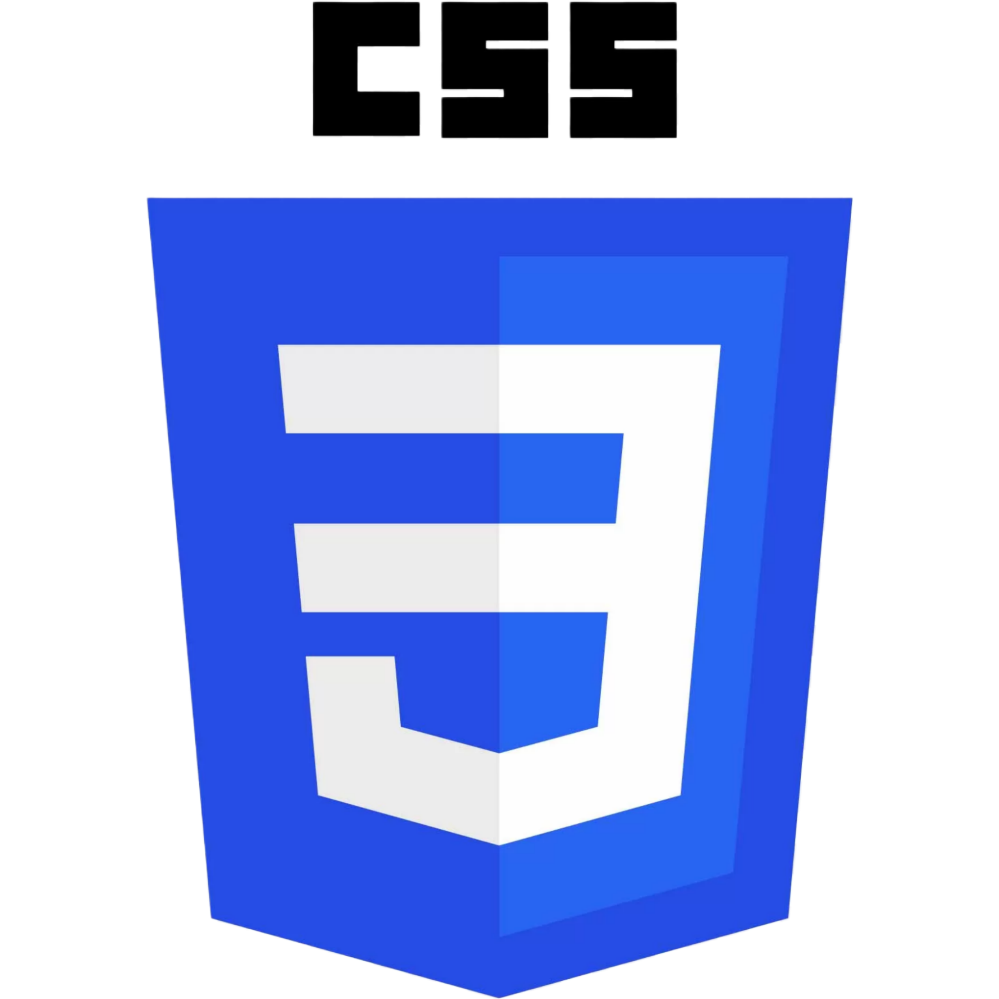
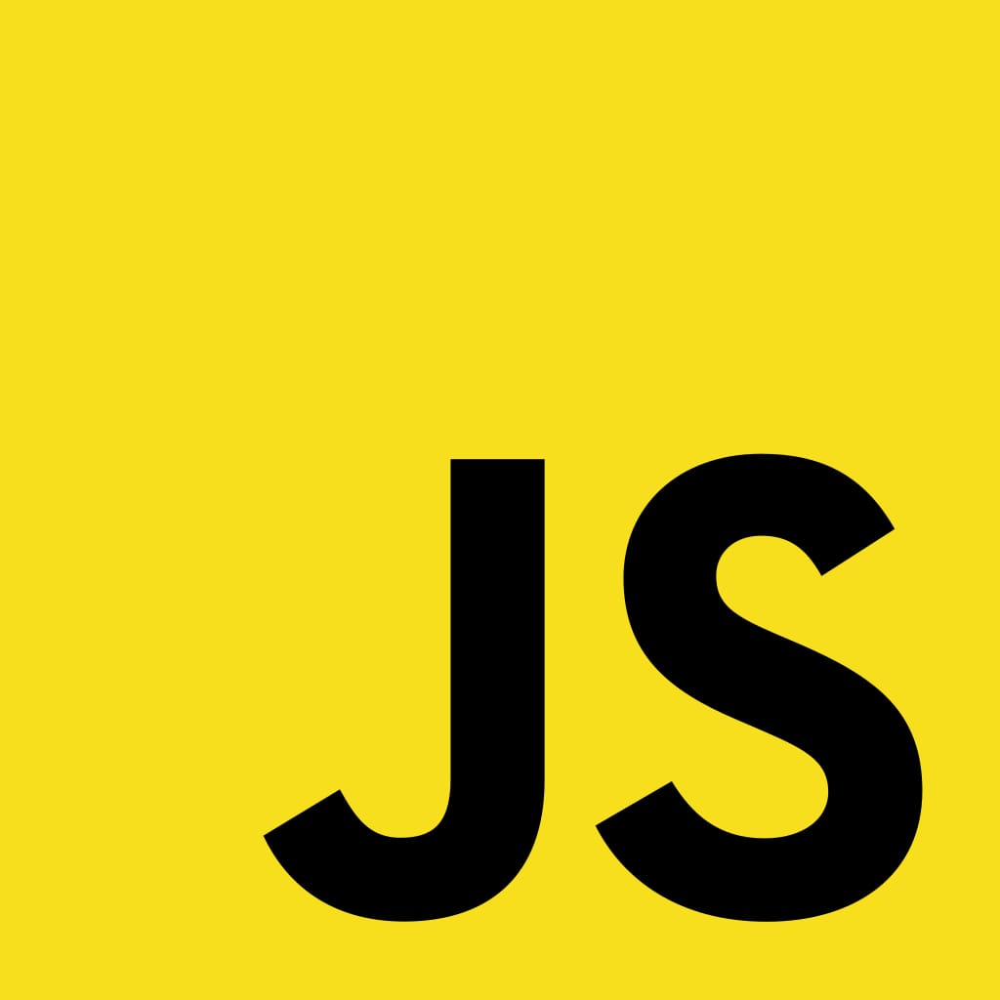
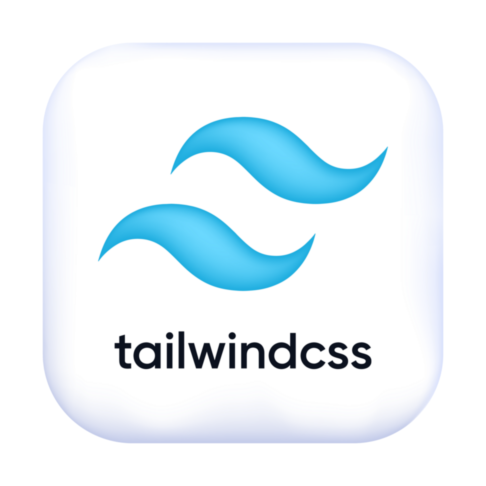
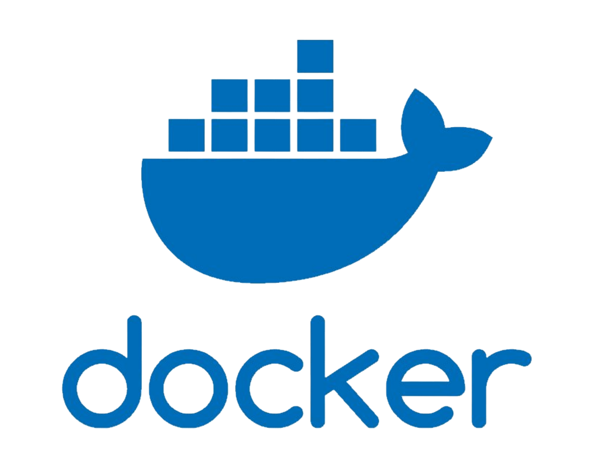

<h1 style="display: flex; justify-content: center; align-items: center; flex-wrap: wrap;">
  <svg width="420" height="60" viewBox="0 0 420 60" xmlns="http://www.w3.org/2000/svg">
    <defs>
      <linearGradient id="grad">
        <stop offset="0%" stop-color="#6366f1">
          <animate attributeName="stop-color" values="#6366f1;#22d3ee;#a855f7;#6366f1" dur="4s" repeatCount="indefinite"/>
        </stop>
        <stop offset="100%" stop-color="#22d3ee">
          <animate attributeName="stop-color" values="#22d3ee;#a855f7;#6366f1;#22d3ee" dur="4s" repeatCount="indefinite"/>
        </stop>
      </linearGradient>
    </defs>
    <text x="50%" y="50%" text-anchor="middle" dominant-baseline="middle"
          font-size="32" font-weight="700"
          fill="url(#grad)"
          style="font-family: system-ui, -apple-system, BlinkMacSystemFont;">
      Desenvolvedor Full Stack
    </text>
  </svg>
  
</h1>

  Acadêmico em <strong>Análise e Desenvolvimento de Sistemas</strong> 
  Desenvolvimento web com <strong>Django</strong>, <strong>APIs REST</strong> e tecnologias modernas.

<h2>Tecnologias</h2>

<h3>Frontend</h2>

  

  <picture style="display: flex; align-items: center;">
    <source media="(prefers-color-scheme: dark)" srcset="./assets/frontend/css-light.png">
    <source media="(prefers-color-scheme: light)" srcset="./assets/frontend/css-dark.png">
    
  </picture>

  

  <picture style="display: flex; align-items: center;">
    <source media="(prefers-color-scheme: dark)" srcset="./assets/frontend/next-js-light.png">
    <source media="(prefers-color-scheme: light)" srcset="./assets/frontend/next-js-dark.png">
    
  </picture>

  

---

<h3>Backend</h3>

  
  

  <picture style="display: flex; align-items: center;">
    <source media="(prefers-color-scheme: dark)" srcset="./assets/backend/django-rest-light.svg">
    <source media="(prefers-color-scheme: light)" srcset="./assets/backend/django-rest-dark.svg">
    
  </picture>

  
  

  <picture style="display: flex; align-items: center;">
    <source media="(prefers-color-scheme: dark)" srcset="./assets/backend/postgresql-light.svg">
    <source media="(prefers-color-scheme: light)" srcset="./assets/backend/postgresql-dark.svg">
    
  </picture>

---

<h3>Ambientes de Desenvolvimento</h3>

  

  <picture style="display: flex; align-items: center;">
    <source media="(prefers-color-scheme: dark)" srcset="./assets/devops/github-light.svg">
    <source media="(prefers-color-scheme: light)" srcset="./assets/devops/github-dark.svg">
    
  </picture>

  
  

---

<h2>Entre em contato</h2>

