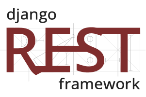

Um Estudante 🚀

> 👨‍💻 Estudante de Análise e Desenvolvimento de Sistemas.

> 🤔 Explorando novas tecnologias e desenvolvendo soluções de software.

> 👨‍💻 Criação de sites com Django e APIs REST utilizando o Django REST Framework.

### Conecte-se comigo

  
  

  

<h2>Desenvolvedor</h2>

  <h3>Backend</h3>
  

    
    
    ⠀
    <a href="https://www.django-rest-framework.org" target="_blank" rel="noreferrer" style="text-decoration: none">
      <picture>
        <source media="(prefers-color-scheme: dark)" srcset="./assets/backend/django-rest-light.svg">
        <source media="(prefers-color-scheme: light)" srcset="./assets/backend/django-rest-dark.svg">
        
      </picture>
    </a>⠀
    <a href="https://www.postgresql.org" target="_blank" rel="noreferrer" style="text-decoration: none">
      <picture>
        <source media="(prefers-color-scheme: dark)" srcset="./assets/backend/postgresql-light.svg">
        <source media="(prefers-color-scheme: light)" srcset="./assets/backend/postgresql-dark.svg">
        
      </picture>
    </a>⠀
  

  <h3>Workspace</h3>
  

    
    <a href="https://github.com" target="_blank" rel="noreferrer" style="text-decoration: none">
      <picture>
        <source media="(prefers-color-scheme: dark)" srcset="./assets/devops/github-light.svg">
        <source media="(prefers-color-scheme: light)" srcset="./assets/devops/github-dark.svg">
        
      </picture>
    </a>
    
    
  

